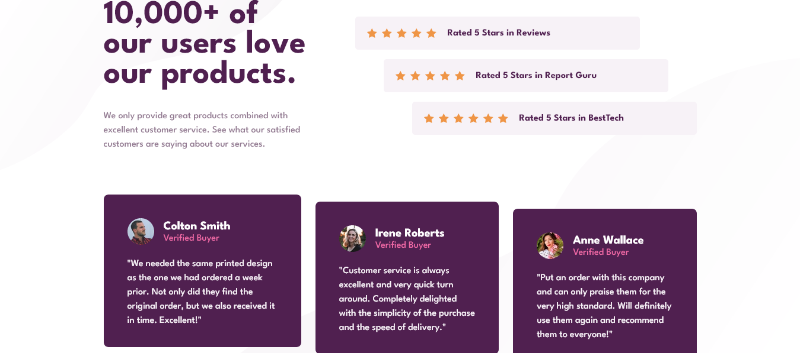

# Frontend Mentor - Social proof section solution

This is a solution to the [Social proof section challenge on Frontend Mentor](https://www.frontendmentor.io/challenges/social-proof-section-6e0qTv_bA). Frontend Mentor challenges help you improve your coding skills by building realistic projects.

## Overview

### The challenge

Users should be able to:

- View the optimal layout for the section depending on their device's screen size

### Screenshot

### Links

- Solution URL: [https://www.frontendmentor.io/solutions/social-proof-section-challenge-az5OHdF1HY](https://www.frontendmentor.io/solutions/social-proof-section-challenge-az5OHdF1HY)
- Live Site URL: [https://verakissyou17.github.io/Social-Proof-Master/](https://verakissyou17.github.io/Social-Proof-Master/)

## My process

### Built with

- Semantic HTML5 markup
- CSS custom properties
- Flexbox
- CSS Grid
